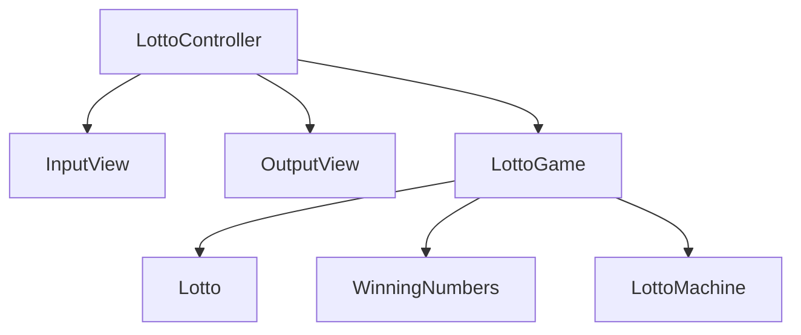

# java-blackjack

로또 미션 저장소

## 도메인 다이어그램

## 기능 구현 목록

### LottoGame

- [x] 로또 숫자와 참가자들을 관리한다.

### 결과

- [x] 결과를 관리한다

### Lotto

- [x] 로또 번호를 저장한다
- [x] 결과를 반환한다?
- [x] 점수를 계산한다?
- [x] 당첨 번호와 비교?

### WinningNumbers

- [x] 당첨 번호를 입력받는다
- [x] 보너스 번호를 입력받는다
- [x] 결과를 반환한다

### LottoMachine

- [x] 숫자를 무작위 생성한다
- [x] 숫자를 정렬한다

### 입력

- [x] 로또 구입 금액을 입력 받는다
  - [x] 금액이 1,000원으로 나누어 떨어지지 않는지 확인한다
  - [x] 금액이 1,000원으로 나누어 떨어지지 않으면 예외 처리한다
- [x] 당첨 번호를 입력 받는다
- [x] 보너스 번호를 입력 받는다

### 출력

- [x] 발행한 로또 수량을 출력한다
- [x] 발행한 로또 번호를 출력한다
- [x] 당첨 통계를 출력한다
- [x] 수익률을 출력한다 (소수점 둘째 자리에서 반올림)
- [x] 예외 상황 시 에러 문구를 출력한다 (단, 에러 문구는 "[ERROR]"로 시작)
